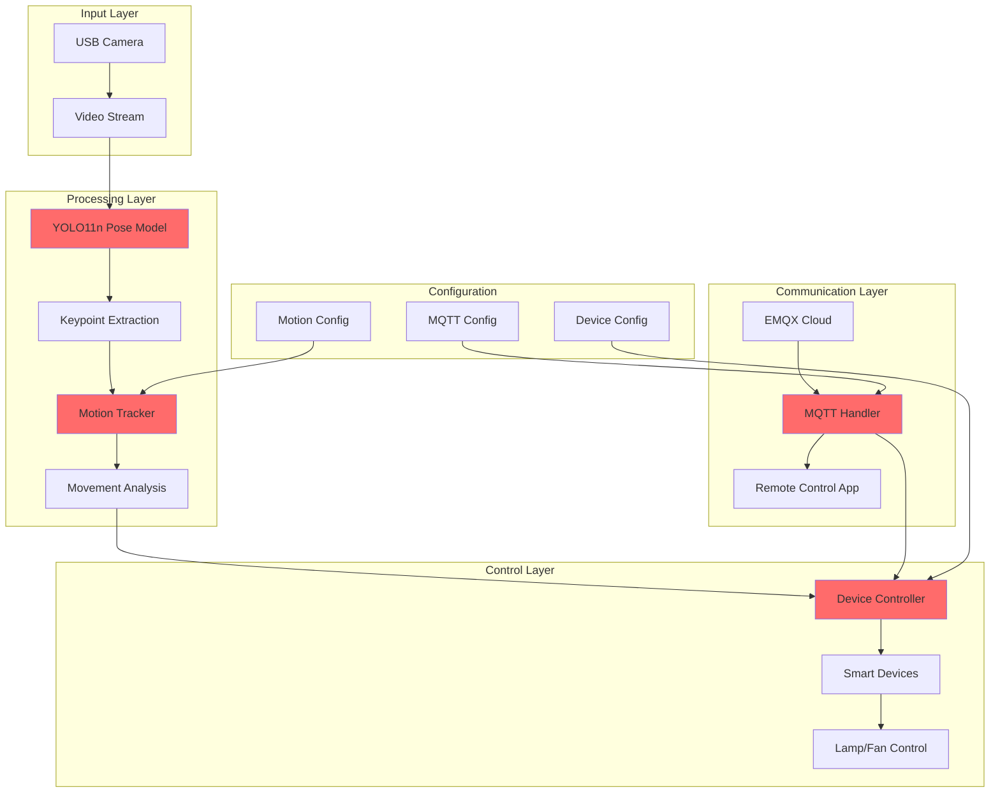

# Smart Motion Detection System

[](https://www.python.org/downloads/)
[](https://opencv.org/)
[](https://ultralytics.com/)
[](https://www.raspberrypi.org/)

> **A cutting-edge IoT system that combines computer vision, skeletal pose estimation, and intelligent device control for automated smart home solutions.**

## 🌟 Overview

The Smart Motion Detection System is an advanced IoT solution that uses YOLO11n pose estimation to detect and analyze human movement patterns in real-time. Unlike traditional motion detectors that rely on simple pixel changes, this system performs sophisticated skeletal analysis to distinguish between meaningful human activity and environmental noise, enabling precise automated control of smart home devices.

## ✨ Key Features

### 🎯 **Intelligent Motion Analysis**
- **Advanced Pose Detection**: YOLO11n-based skeleton tracking with 17 keypoint analysis
- **Smart Movement Filtering**: Distinguishes between meaningful motion and environmental noise
- **Stability Analysis**: Multi-frame pose stability verification to prevent false triggers
- **Relative Movement Calculation**: Normalized motion analysis independent of position in frame

### 🏠 **Smart Device Integration**
- **Multi-Device Control**: Automated control of lamps, fans, and other GPIO-connected devices
- **Three Operation Modes**: Automatic, Manual, and Scheduled control
- **Intelligent Auto-Off**: Configurable delay before devices turn off when no motion detected
- **Real-time State Management**: Instant device status updates and feedback

### 🌐 **IoT Connectivity**
- **Secure MQTT Communication**: SSL/TLS encrypted messaging via EMQX Cloud
- **Remote Device Control**: Control devices from anywhere via MQTT commands
- **Real-time Status Updates**: Live motion detection and device status reporting
- **Dynamic Configuration**: Update system parameters remotely without restart

### 📊 **Performance Monitoring**
- **Real-time FPS Display**: Live performance metrics and optimization
- **Motion Analytics**: Detailed movement pattern analysis and reporting
- **System Health Monitoring**: Comprehensive error handling and status reporting

## 🏗️ System Architecture



## 🚀 Quick Start Guide

### Prerequisites

#### Hardware Requirements
- **Raspberry Pi 5** (recommended) or compatible Linux system
- **USB Camera** (640x480 minimum resolution)
- **GPIO-compatible devices** (LEDs, relay modules, etc.)
- **Stable internet connection** for MQTT communication

#### Software Requirements
- Python 3.8 or higher
- OpenCV 4.5+
- YOLO11n pose model
- MQTT broker access (EMQX Cloud recommended)

### Installation

1. **Clone the repository**
```bash
git clone https://github.com/CPS-TelU/AIoT-dmouv2025
cd AIoT-dmouv2025
```

2. **Install system dependencies**
```bash
sudo apt update
sudo apt install -y python3-pip python3-opencv
```

3. **Install Python packages**
```bash
pip3 install -r requirements.txt
```

4. **Configure MQTT settings**
```bash
# Edit the MQTTConfig class in the main script
class MQTTConfig:
    BROKER = " ... "
    PORT = ...
    USERNAME = " ... "
    PASSWORD = " ... "
    DEVICE_IP = " ... "
    
    STATUS_TOPIC = f"iot/{DEVICE_IP}/status"
    SENSOR_TOPIC = f"iot/{DEVICE_IP}/sensor"
    ACTION_TOPIC = f"iot/{DEVICE_IP}/action"
    SETTINGS_UPDATE_TOPIC = f"iot/{DEVICE_IP}/settings/update"
```

5. **Run the system**
```bash
python3 AIoT-dmouv2025.py
```

## ⚙️ Configuration Options

### Motion Detection Parameters

| Parameter | Default | Description |
|-----------|---------|-------------|
| `ENABLED` | `True` | Enable/disable motion detection |
| `DETECTION_DURATION` | `1.0s` | Minimum duration for motion validation |
| `MOVEMENT_THRESHOLD` | `85.0` | Pixel movement threshold for detection |
| `CONFIDENCE_THRESHOLD` | `0.5` | YOLO keypoint confidence threshold |
| `STABLE_DETECTION_FRAMES` | `10` | Frames required for stable detection |
| `MIN_STABLE_KEYPOINTS` | `5` | Minimum stable keypoints required |
| `AUTO_OFF_DELAY` | `10.0s` | Delay before auto turn-off |

### Device Configuration

```python
class DeviceConfig:
    LAMP_PIN = 26    # GPIO pin for lamp control
    FAN_PIN = 19     # GPIO pin for fan control
```

### Camera Settings

```python
class CameraConfig:
    SOURCE = "usb0"              # Camera source (usb0, usb1, etc.)
    RESOLUTION_WIDTH = 640       # Frame width
    RESOLUTION_HEIGHT = 480      # Frame height
    FPS_BUFFER_SIZE = 50         # FPS calculation buffer
```

## 🎮 Operation Modes

### 1. **Automatic Mode** (Default)
- Devices automatically activate when human motion is detected
- Intelligent analysis prevents false triggers from pets, shadows, or environmental changes
- Configurable auto-off delay when no motion is detected
- Ideal for daily use and energy efficiency

### 2. **Manual Mode**
- Direct device control via MQTT commands
- Overrides automatic behavior
- Perfect for maintenance, testing, or when you want full control
- Commands: `{"device": "lamp", "action": "turn_on"}` or `"turn_off"`

### 3. **Scheduled Mode**
- Time-based device control with complex scheduling
- Independent of motion detection
- Supports different schedules for different devices
- Format: `{"device": "lamp", "schedule_on": "18:00", "schedule_off": "23:00"}`

## 🌐 MQTT Communication

### Topic Structure

```
iot/{DEVICE_IP}/
├── status          # Device online/offline status
├── sensor          # Motion detection events
├── action          # Device control commands
└── settings/update # Configuration updates
```

## 🔬 Technical Deep Dive

### Motion Detection Algorithm

The system employs a sophisticated multi-stage approach:

1. **Pose Extraction**: YOLO11n identifies 17 human keypoints with confidence scores
2. **Stability Filtering**: Only keypoints above confidence threshold are considered
3. **Center Point Calculation**: Computes the center of mass from stable keypoints
4. **Movement Analysis**: Calculates relative movement between consecutive frames
5. **Validation**: Ensures movement exceeds thresholds for both duration and distance
6. **State Management**: Manages detection states with proper cooldown periods

### Key Classes Overview

```python
# Core motion detection and analysis
class MotionTracker:
    - get_stable_keypoints()      # Filter high-confidence keypoints
    - calculate_pose_center()     # Compute center of mass
    - detect_skeleton_motion()    # Analyze movement patterns
    - update_motion_detection()   # Main detection loop

# Individual device management
class SmartDevice:
    - turn_on() / turn_off()      # Device control
    - set_mode()                  # Change operation mode
    - set_schedule()              # Configure scheduling

# MQTT communication handler
class MQTTHandler:
    - SSL/TLS secure connection
    - Automatic reconnection
    - Message routing and handling

# Main system orchestrator
class SmartMotionDetectionSystem:
    - Camera management
    - Model initialization
    - Device coordination
    - Performance monitoring
```

## 📊 Performance Optimization

### Hardware Recommendations
- **Raspberry Pi 5 (4GB+)**: Optimal performance for real-time processing
- **High-quality USB camera**: Better keypoint detection accuracy
- **Fast SD card (Class 10+)**: Improved I/O performance
- **Adequate power supply**: Prevents system instability

### Software Optimization
- **Model Selection**: YOLO11n-pose provides best speed/accuracy balance
- **Frame Resolution**: 640x480 recommended for Pi 4
- **Buffer Management**: Configurable FPS buffer for smooth performance
- **Memory Management**: Efficient deque structures for historical data

## 🙏 Acknowledgments

- **[Ultralytics](https://ultralytics.com/)**: For the excellent YOLO11n implementation
- **[OpenCV Team](https://opencv.org/)**: For comprehensive computer vision tools
- **[Eclipse Paho](https://www.eclipse.org/paho/)**: For reliable MQTT client library
- **[GPIO Zero](https://gpiozero.readthedocs.io/)**: For simplified GPIO control
- **[EMQX](https://www.emqx.com/)**: For robust cloud MQTT broker services

---

<div align="center">
  <p><strong>Intern CPS Research Group</strong></p>
</div>
