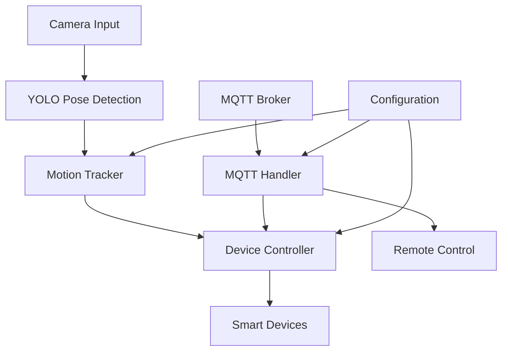

# Smart Motion Detection System

[](https://www.python.org/downloads/)
[](LICENSE)
[](https://opencv.org/)
[](https://ultralytics.com/)

A comprehensive IoT-based motion detection system that combines computer vision, MQTT communication, and automated device control using YOLO pose estimation for intelligent human motion analysis.

## 🎯 Features

- **Real-time Human Pose Detection**: Advanced YOLO-based skeleton tracking
- **Intelligent Motion Analysis**: Sophisticated algorithm for detecting meaningful human movement
- **IoT Device Control**: Automated control of smart devices (lamps, fans, etc.)
- **Multiple Operation Modes**: Auto, Manual, and Scheduled device control
- **MQTT Communication**: Secure SSL/TLS enabled MQTT messaging
- **FPS Monitoring**: Real-time performance tracking and optimization
- **Remote Configuration**: Dynamic settings update via MQTT
- **Robust Error Handling**: Comprehensive exception management and graceful degradation

## 🏗️ System Architecture



## 🚀 Quick Start

### Prerequisites

- Python 3.8 or higher
- Raspberry Pi (recommended) or compatible Linux system
- USB camera
- GPIO-compatible devices (LEDs, relays, etc.)

## ⚙️ Configuration

### Motion Detection Parameters

```python
class MotionDetectionConfig:
    ENABLED = True                          # Enable/disable motion detection
    DETECTION_DURATION = 1.0               # Minimum motion duration (seconds)
    MOVEMENT_THRESHOLD = 85.0              # Pixel movement threshold
    CONFIDENCE_THRESHOLD = 0.5             # YOLO confidence threshold
    STABLE_DETECTION_FRAMES = 10           # Frames for stable detection
    MOTION_COOLDOWN = 1.0                  # Cooldown between detections
    AUTO_OFF_DELAY = 10.0                  # Auto turn-off delay (seconds)
```

### Device Configuration

```python
class DeviceConfig:
    LAMP_PIN = 26    # GPIO pin for lamp control
    FAN_PIN = 19     # GPIO pin for fan control
```

### MQTT Topics

| Topic | Description |
|-------|-------------|
| `iot/{DEVICE_IP}/status` | Device online/offline status |
| `iot/{DEVICE_IP}/sensor` | Motion detection events |
| `iot/{DEVICE_IP}/action` | Device control commands |
| `iot/{DEVICE_IP}/settings/update` | Configuration updates |

## 🎮 Usage

### Operating Modes

#### 1. **Automatic Mode** (Default)
- Devices automatically turn on when motion is detected
- Devices turn off after configurable delay when no motion
- Intelligent motion analysis prevents false triggers

#### 2. **Manual Mode**
- Direct device control via MQTT commands
- Overrides automatic behavior
- Useful for maintenance or testing

#### 3. **Scheduled Mode**
- Time-based device control
- Supports complex scheduling scenarios
- Independent of motion detection

## 🔧 Technical Details

### Motion Detection Algorithm

The system employs a sophisticated multi-stage motion detection process:

1. **Pose Extraction**: YOLO11n identifies human keypoints with confidence scores
2. **Stability Analysis**: Filters stable keypoints above confidence threshold
3. **Movement Calculation**: Computes relative movement between frame sequences
4. **Motion Validation**: Validates significant movement over minimum duration
5. **State Management**: Manages detection states with cooldown periods

### Key Components

- **`MotionTracker`**: Core motion detection and analysis logic
- **`SmartDevice`**: Individual device representation and control
- **`MQTTHandler`**: Secure MQTT communication with SSL/TLS
- **`SmartMotionDetectionSystem`**: Main orchestrator class

## 🙏 Acknowledgments

- **Ultralytics**: For the excellent YOLO implementation
- **OpenCV**: For computer vision capabilities
- **Eclipse Paho**: For MQTT client library
- **GPIO Zero**: For simplified GPIO control
  
---

# embedded-dmouv

AIoT Research Team

# NOTE

For local development _ONLY_ using mosquitto as MQTT Broker
For releases use the EMQX Cloud as MQTT Broker

# Software Structure

The program parses a configuration file at start-up to set initial settings.
Separate classes are used for each category of devices, lights,
fan, status, and automatic/manual interaction (action). These classes provide methods for controlling and reading the state of these devices.
A timer is used to schedule on and off times for the lights and other devices. Schedule can be controlled by the main app

# Installation (Choose one)

This project was developed on a Raspberry Pi running
[Raspberry Pi OS](https://www.raspberrypi.org/software/operating-systems/)
(32-bit or 64-bit) and written in Python version 3.
The code relies heavily on [Mosquitto MQTT](https://mosquitto.org/) or [EMQX](htttps://emqx.com)
to bridge a network of devices through MQTT (a common IoT networking protocol) and backend (node.js)

## 1.1 Install Mosquitto

The first step is to install `mosquitto` which provides an open source MQTT broker.
This can be installed from the command-line as follows:

```bash
sudo apt install -y mosquitto mosquitto-clients
```

Since we will be connecting to the MQTT broker locally, we can edit the mosquitto
configuration file to explicitly listen _only_ on the local loopback interface.
This can be done by adding the following lines in `/etc/mosquitto/conf.d/local.conf`:

```bash
listener 1883
allow_anonymous true
```

Next, enable the `mosquitto` broker service as follows:

```bash
sudo systemctl enable mosquitto.service
```

Ensure the `mosquitto` service is now running by typing:

```bash
sudo service mosquitto status
```

## 1.2 Install EMQX

The first step is to install `EMQX` which provides an open source MQTT broker.
This can be installed through their web by signing up as new user. After sign up, you will jump to EMQX Platform where MQTT Connection informations relies.

```bash
Address:
[broker address].emqxsl.com
MQTT over TLS/SSL Port: 8883
WebSocket over TLS/SSL Port: 8084
CA Certificate
```

_REMEMBER_ to use SSL Port over TLS

```python
import ssl
```

## Setting up the Python control software

Once the MQTT Broker is installed and devices are successfully paired we can setup the
`dmouv_motion_det_final.py` control program itself. This program communicates with devices by
sending messages to the MQTT broker which are then bridged to our backend services.
The control program is written in Python version 3 and uses the
[paho-mqtt](https://www.eclipse.org/paho/index.php?page=clients/python/index.php) library to send
MQTT messages. The dependencies for `dmouv_motion_det_final.py` can all be installed from the command-line as follows:

```bash
sudo apt-get install python3-pip
pip3 install paho-mqtt
```

## Configuration

Dmouv includes a `config.py` configuration file which should be adjusted to reflect
your local settings. In particular, you will need to specify the "friendly names" of any devices, and lights you are using along with the Broker Address of the MQTT broker for
reaching the backend services.
Furthermore, we can set the right time frame through this file.

## Launching the program

The program can be launched from the command-line from the installation folder as follows:

```bash
python3 dmouv_motion_det_final.py
```

The `dmouv_motion_det_final.py` program may also be automatically launched at boot time as a systemd service.
This service must be configured to wait for the network to come online before starting.
This can be configured by creating a systemd service file in `/etc/systemd/system/Dmouv.service`
with the following settings:

```bash
[Unit]
Description=all
After=network-online.target
[Service]
ExecStart=/bin/sh -c "/usr/bin/python3 all.py"
WorkingDirectory=/home/cps/DMouv/yolov11n
Restart=always
User=cps
[Install]
WantedBy=multi-user.target
```

Note that the `User` and `WorkingDirectory` will need to be set to reflect
your default username and the directory where the Dmouv source files are installed.
Finally, enable the Dmouv service as follows:

```bash
sudo systemctl enable DMove.service
```

Reboot the computer and ensure that the service is started as expected. To check the status
of the service, type:

```bash
sudo systemctl status DMove.service
```
