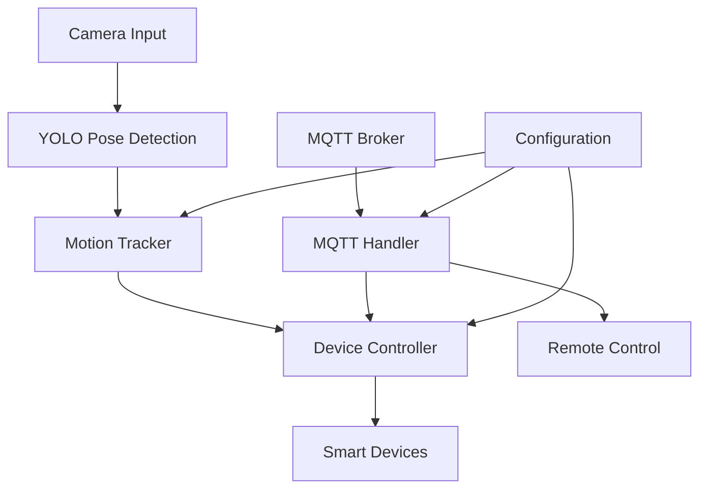

# Smart Motion Detection System

[](https://www.python.org/downloads/)
[](LICENSE)
[](https://opencv.org/)
[](https://ultralytics.com/)

A comprehensive IoT-based motion detection system that combines computer vision, MQTT communication, and automated device control using YOLO pose estimation for intelligent human motion analysis.

## 🎯 Features

- **Real-time Human Pose Detection**: Advanced YOLO-based skeleton tracking
- **Intelligent Motion Analysis**: Sophisticated algorithm for detecting meaningful human movement
- **IoT Device Control**: Automated control of smart devices (lamps, fans, etc.)
- **Multiple Operation Modes**: Auto, Manual, and Scheduled device control
- **MQTT Communication**: Secure SSL/TLS enabled MQTT messaging
- **FPS Monitoring**: Real-time performance tracking and optimization
- **Remote Configuration**: Dynamic settings update via MQTT
- **Robust Error Handling**: Comprehensive exception management and graceful degradation

## 🏗️ System Architecture



## 🚀 Quick Start

### Prerequisites

- Python 3.8 or higher
- Raspberry Pi (recommended) or compatible Linux system
- USB camera
- GPIO-compatible devices (LEDs, relays, etc.)

## ⚙️ Configuration

### Motion Detection Parameters

```python
class MotionDetectionConfig:
    ENABLED = True                          # Enable/disable motion detection
    DETECTION_DURATION = 1.0               # Minimum motion duration (seconds)
    MOVEMENT_THRESHOLD = 85.0              # Pixel movement threshold
    CONFIDENCE_THRESHOLD = 0.5             # YOLO confidence threshold
    STABLE_DETECTION_FRAMES = 10           # Frames for stable detection
    MOTION_COOLDOWN = 1.0                  # Cooldown between detections
    AUTO_OFF_DELAY = 10.0                  # Auto turn-off delay (seconds)
```

### Device Configuration

```python
class DeviceConfig:
    LAMP_PIN = 26    # GPIO pin for lamp control
    FAN_PIN = 19     # GPIO pin for fan control
```

### MQTT Topics

| Topic | Description |
|-------|-------------|
| `iot/{DEVICE_IP}/status` | Device online/offline status |
| `iot/{DEVICE_IP}/sensor` | Motion detection events |
| `iot/{DEVICE_IP}/action` | Device control commands |
| `iot/{DEVICE_IP}/settings/update` | Configuration updates |

## 🎮 Usage

### Operating Modes

#### 1. **Automatic Mode** (Default)
- Devices automatically turn on when motion is detected
- Devices turn off after configurable delay when no motion
- Intelligent motion analysis prevents false triggers

#### 2. **Manual Mode**
- Direct device control via MQTT commands
- Overrides automatic behavior
- Useful for maintenance or testing

#### 3. **Scheduled Mode**
- Time-based device control
- Supports complex scheduling scenarios
- Independent of motion detection

## 🔧 Technical Details

### Motion Detection Algorithm

The system employs a sophisticated multi-stage motion detection process:

1. **Pose Extraction**: YOLO11n identifies human keypoints with confidence scores
2. **Stability Analysis**: Filters stable keypoints above confidence threshold
3. **Movement Calculation**: Computes relative movement between frame sequences
4. **Motion Validation**: Validates significant movement over minimum duration
5. **State Management**: Manages detection states with cooldown periods

### Key Components

- **`MotionTracker`**: Core motion detection and analysis logic
- **`SmartDevice`**: Individual device representation and control
- **`MQTTHandler`**: Secure MQTT communication with SSL/TLS
- **`SmartMotionDetectionSystem`**: Main orchestrator class

## 🙏 Acknowledgments

- **Ultralytics**: For the excellent YOLO implementation
- **OpenCV**: For computer vision capabilities
- **Eclipse Paho**: For MQTT client library
- **GPIO Zero**: For simplified GPIO control
  
---
